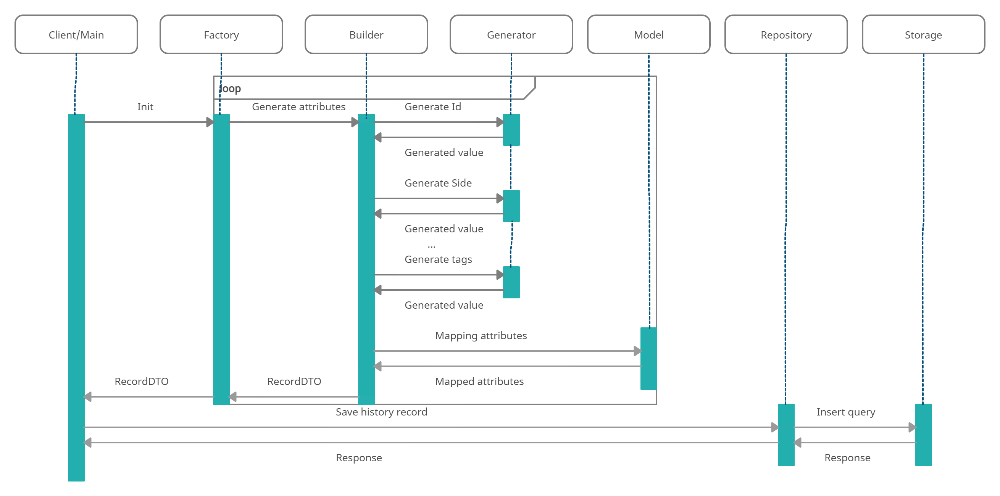
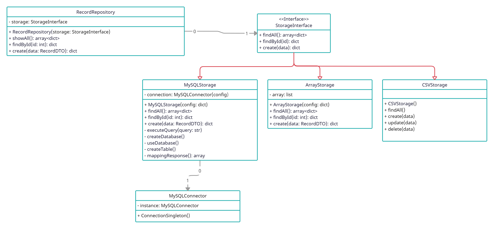
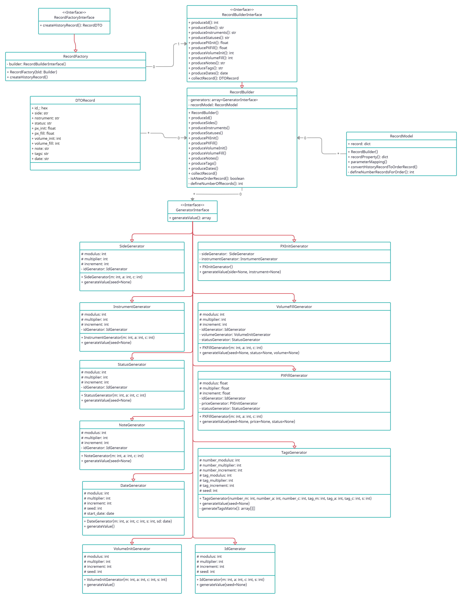

# <p align="center">Transaction history generator</p>

[](https://stand-with-ukraine.pp.ua)
[](https://github.com/yakimenko73/transaction-generator/blob/master/LICENSE)
[](https://www.codefactor.io/repository/github/yakimenko73/transaction-generator)

## What is it?

Script to create a pseudo-random trading orders history. Example:
```
ID, SIDE, INSTRUMENT, STATUS, PX_INIT, PX_FILL, VOLUME_INIT, VOLUME_FILL, NOTE, TAGS, DATE
0x102c386bbc5, BUY, EURCHF, IN_PROCESS, 1.88491, 1.88491, 10800, 4481, NOTE4, [REGULAR_TRADE], 2022-01-01 00:00:14.750000+00:00
0x102c386bbc5, BUY, EURCHF, PARTIAL_FILL, 1.88491, 1.88491, 10800, 4481, NOTE4, [REGULAR_TRADE], 2022-01-01 00:00:14.764000+00:00
0x102c386bbc5, BUY, EURCHF, DONE, 1.88491, 1.88491, 10800, 4481, NOTE4, [REGULAR_TRADE], 2022-01-01 00:00:14.778000+00:00
0x1a2f4a85579, SELL, EURRUB, IN_PROCESS, 91.31132, 0, 6400, 0, NOTE4, "[TRANSFER,  DISTANCE_TRADE,  DISTANCE_TRADE,  SPECIAL_TRADE]", 2022-01-01 00:00:21.341000+00:00
0x1a2f4a85579, SELL, EURRUB, CANCEL, 91.31132, 0, 6400, 0, NOTE4, "[TRANSFER,  DISTANCE_TRADE,  DISTANCE_TRADE,  SPECIAL_TRADE]", 2022-01-01 00:00:21.362000+00:00
0x1a2f4a85579, SELL, EURRUB, DONE, 91.31132, 0, 6400, 0, NOTE4, "[TRANSFER,  DISTANCE_TRADE,  DISTANCE_TRADE,  SPECIAL_TRADE]", 2022-01-01 00:00:21.383000+00:00
0x5ed961cb678, SELL, EURCAD, IN_PROCESS, 1.41313, 1.74895, 8800, 1985, NOTE5, "[SPECIAL_TRADE,  DISTANCE_TRADE,  REGULAR_TRADE]", 2022-01-01 00:00:25.929000+00:00
0x5ed961cb678, SELL, EURCAD, PARTIAL_FILL, 1.41313, 1.74895, 8800, 1985, NOTE5, "[SPECIAL_TRADE,  DISTANCE_TRADE,  REGULAR_TRADE]", 2022-01-01 00:00:25.954000+00:00
0x5ed961cb678, SELL, EURCAD, DONE, 1.41313, 1.74895, 8800, 1985, NOTE5, "[SPECIAL_TRADE,  DISTANCE_TRADE,  REGULAR_TRADE]", 2022-01-01 00:00:25.979000+00:00
```

### Built With

* [Python 3.x](https://www.python.org/)
* [Loguru](https://github.com/Delgan/loguru)
* [Pydantic](https://github.com/pydantic/pydantic)

### Installation

Requires Python >= 3.8

1. Install requirements
   ```sh
   pip3 install -r requirements.txt
   ```
2. Runs script
   ```sh
   cd src && python3 main.py
   ```

## Diagrams [**DEPRECATED**]

### Sequence diagram



### UML diagram for storage classes



### UML diagram for workflow classes



## Contributing

Contributions are what make the open source community such an amazing place to learn, inspire, and create. Any
contributions you make are **greatly appreciated**.

If you have a suggestion that would make this better, please fork the repo and create a pull request. You can also
simply open an issue with the tag "enhancement". Don't forget to give the project a star! Thanks again!

1. Fork the Project
2. Create your Feature Branch (`git checkout -b feature/amazing-feature`)
3. Commit your Changes (`git commit -m 'Add some amazing-feature'`)
4. Push to the Branch (`git push origin feature/amazing-feature`)
5. Open a Pull Request

## Contact

* Email - r.yakimenko.73@gmail.com
